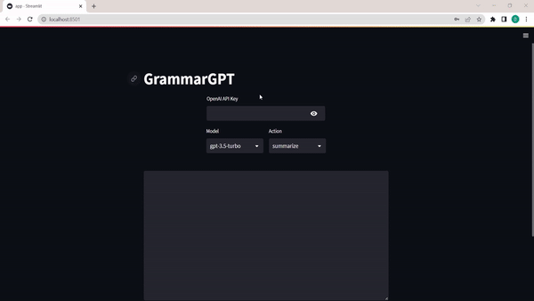

# grammarGPT: Your Ultimate Grammarly Alternative! 
grammarGPT is a free application that harnesses the power of AI to provide suggestions, helping to improve the coherence, style and clarity of your texts. Whether you write emails, professional reports, or even social media posts. 

:link: [Live demo](https://nechubm-grammargpt-srcapp-tutorial-jh5vw1.streamlit.app/)



## Introduction
grammarGPT is an awesome project that demonstrates the power of AI and the ease of creating apps using Python. To learn how to build this app step by step follow the tutorial in the Youtube link below (**English and Spanish**).
For developing the app in less than 200 lines of code and only using Python we need:
* ChatGPT API
* Streamlit

:warning: Tutorial code in branch [tutorial](https://github.com/NechuBM/grammarGPT/tree/tutorial)

[English tutorial | Youtube](https://youtu.be/pVwG2RpTgU8)

[Tutorial en Español | Youtube](https://youtu.be/0iRRRmnJW3s) 


## How to Use grammarGPT
Using grammarGPT is easy! Here are the steps:
1. Clone or download the repository to your local machine.
2. Install the required libraries by running the following command in your terminal:
```console
pip install -r requirements.txt
```
3. Move to the *src* folder and run the app using the following command:
```console
streamlit run app.py
```
4. Obtain an API key from OpenAI to use their ChatGPT API.
5. Select 'Summarize', 'Paraphrase' or 'Spellcheck'.
6. Paste your text into the text box on the app.
7. Click the "Run" button and let AI do the rest!

## Conclusion
grammarGPT is a great project that shows how easy it is to create powerful apps using ChatGPT and Streamlit. With less than 200 lines of code and Python you can build an app that summarize, paraphrase and spellcheck your text, saving you time and improving your writting skills. Give it a try today and see how it can help you improve the coherence, style and clarity of your texts!